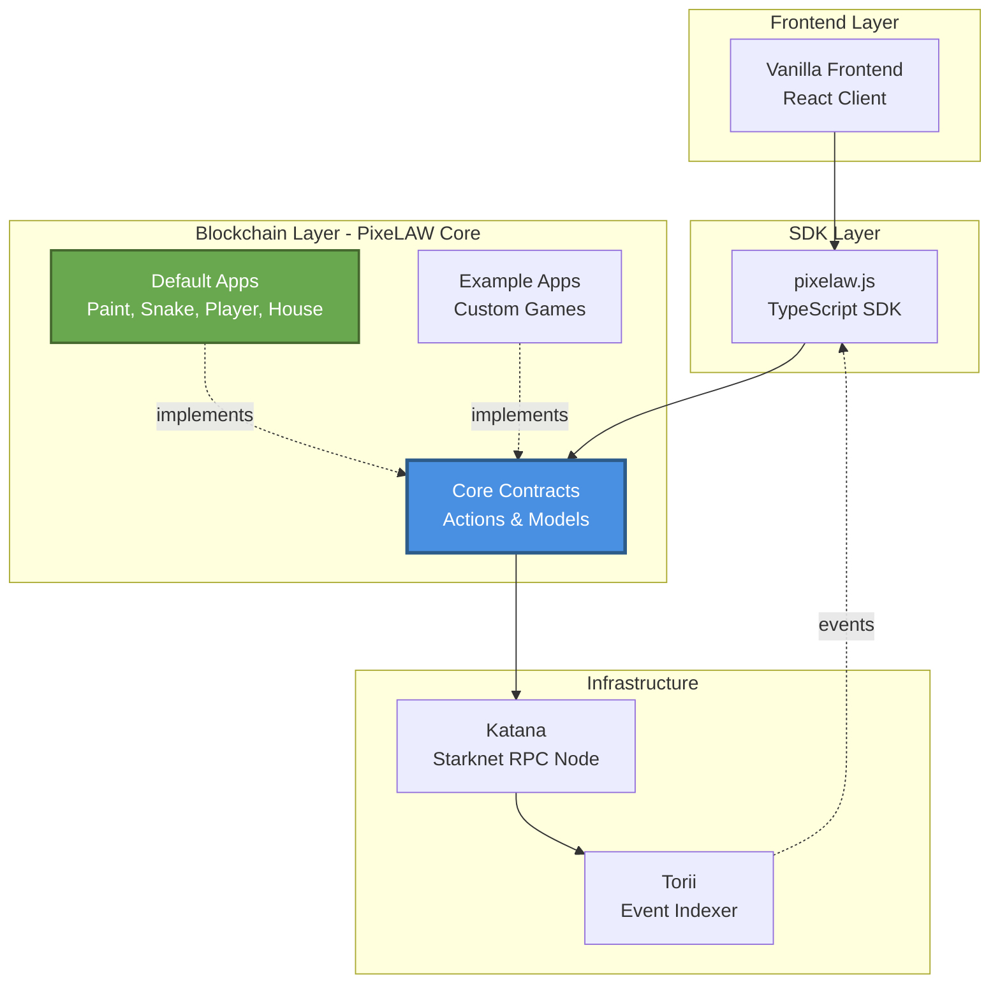

# PixeLAW Core

<div align="center">


[](https://github.com/pixelaw/core/actions/workflows/ci-contracts.yml)
[](https://t.co/jKDjNbFdZ5)
[](https://x.com/0xpixelaw)
[](https://github.com/pixelaw/core)

**The foundational smart contract framework for building interactive, composable pixel-based games on Starknet**

[Documentation](https://pixelaw.github.io/book/index.html) • [Examples](../examples/) • [SDK](../pixelaw.js/) • [Frontend](../vanilla/)

</div>

---

## What is PixeLAW Core?

**PixeLAW Core** is the foundational smart contract layer of the PixeLAW ecosystem, built on **Starknet** using the **Dojo ECS framework**. It provides the primitives and infrastructure for creating interactive pixel-based autonomous worlds where multiple applications can coexist and interact on a shared 2D grid.

Think of it as the "operating system" for pixel-based blockchain games. Core defines:
- **The Pixel World**: A 2D Cartesian plane where each position (x, y) represents a programmable pixel
- **App System**: Modular applications that define pixel behavior and game mechanics
- **Permission Framework**: Ownership rules and App2App interaction controls through hooks
- **Spatial Infrastructure**: Area management with R-Tree indexing for efficient queries
- **Temporal System**: Queue-based scheduling for time-delayed actions

Whether you're building a simple painting app, a complex strategy game, or an emergent multi-app experience, PixeLAW Core provides the composable primitives to make it happen—all on-chain, all verifiable, all interoperable.

---

## Architecture

PixeLAW Core sits at the heart of the ecosystem, providing the blockchain layer that everything else builds upon:



**Core provides**:
- Smart contract primitives (Pixel, Area, Queue, App Registry)
- Permission system with hooks for App2App interactions
- Default apps demonstrating core patterns
- Docker image with pre-initialized blockchain state

**Everything else consumes**:
- Frontend (Vanilla) uses SDK to interact with Core
- SDK (pixelaw.js) abstracts Core interactions into TypeScript
- Example apps build on Core to create custom games

---

## Key Concepts

### 🟦 Pixel World
A 2D Cartesian plane (max 32,767 x 32,767) where every position is a **Pixel** with properties:
- **Position**: (x, y) coordinates—immutable and unique
- **App**: Contract address defining the pixel's behavior
- **Color**: RGBA value for visual representation
- **Owner**: Address with full control over the pixel
- **Text**: Arbitrary text data for labels or metadata
- **Alert**: Special notification flag
- **Timestamps**: Created, updated, and custom timestamps

### 🎮 Apps
Smart contracts that define pixel behavior. Each pixel is managed by exactly one app. Apps can:
- Register with the Core registry
- Implement custom interaction logic
- Define permission rules via hooks
- Schedule future actions via the queue
- Interact with other apps through the permission system

### 🔗 App2App Interactions
The **Hook System** enables controlled interactions between apps:

```cairo
fn on_pre_update(
    pixel_update: PixelUpdate,
    app_caller: ContractAddress,
    player_caller: ContractAddress,
) -> Option<PixelUpdate>
```

- **`on_pre_update`**: Called BEFORE a pixel update—can allow, deny, or modify
- **`on_post_update`**: Called AFTER a pixel update—for side effects and reactions

This pattern allows complex emergent gameplay without modifying Core contracts.

### 📍 Areas
Rectangular spatial regions with ownership and permissions, indexed by **R-Tree** for O(log n) queries:
- Define territories with custom rules
- Control access to pixel groups
- Efficiently query "what area contains this position?"

### ⏰ Queue System
Schedule actions for future execution with cryptographic integrity:
- Actions stored with timestamp and poseidon hash
- External bots/schedulers execute when ready
- Prevents tampering with queued data
- Enables time-based game mechanics (cooldowns, delayed effects)

---

## Features

### ✨ Default Apps Included

PixeLAW Core ships with four default apps demonstrating core patterns:

| App | Purpose | Key Functions |
|-----|---------|---------------|
| **Paint** | Basic pixel coloring and image rendering | `put_color`, `remove_color`, `put_fading_color` |
| **Snake** | Classic snake game with collision detection | `move`, `interact` (spawn) |
| **Player** | Player character representation | `interact` (move), `configure` (name/emoji) |
| **House** | Building and area management | `build`, `demolish` |

### 🧪 Comprehensive Test Suite
- **33 passing tests** covering all core functionality
- Pixel CRUD operations and permission validation
- Area management and R-Tree spatial queries
- Queue scheduling and integrity checks
- Hook invocation and App2App interactions
- Testing utilities via `pixelaw_test_utils` package

### 🐳 Production-Ready Docker Image
Multi-stage Docker build with:
- Pre-compiled contracts with Dojo 1.7.1
- Katana RPC node (port 5050)
- Torii indexer (port 8080)
- Pre-initialized blockchain snapshot for instant startup
- PM2 process management for all services

### 🔧 Developer-Friendly Tools
- `justfile` commands for common tasks
- `pixelaw_test_utils` package with testing helpers
- Comprehensive error messages with position tracking
- Modern Dojo 1.7.1 patterns and best practices

---

## Version Compatibility

| Component | Version | Notes |
|-----------|---------|-------|
| **PixeLAW Core** | `0.8.0-dev` | Current development version |
| **Dojo Framework** | `1.7.1` | ECS framework for blockchain games |
| **Cairo** | `2.12.2` | Smart contract language |
| **Scarb** | `2.12.2` | Package manager and build tool |
| **Starknet** | `2.12.2` | Layer 2 blockchain |

> **⚠️ Breaking Changes in Dojo 1.7.1**: If upgrading from earlier versions, see the migration guide in `examples/DOJO_1.7.1_UPGRADE_GUIDE.md`

---

## Quick Start

### Running PixeLAW Core with Docker

The fastest way to get started is using the pre-built Docker image:

```bash
# Pull the latest image
docker pull ghcr.io/pixelaw/core:latest

# Or build locally
cd core
make docker_build

# Run with docker-compose
docker compose up -d

# Services now available:
# - Katana RPC: http://localhost:5050
# - Torii Indexer: http://localhost:8080
# - Dashboard: http://localhost:3000
```

### Building from Source

```bash
cd core

# Build contracts
just build

# Run tests
just test

# Run filtered tests
just test_filtered "snake"

# Start development environment (Katana + Torii)
docker compose up -d

# Deploy contracts to local Katana
cd contracts
sozo migrate apply

# Initialize contracts
scarb run init
```

### Creating Your First App

See the [Examples repository](../examples/) for complete app templates. Basic structure:

```cairo
#[dojo::contract]
mod my_app {
    use pixelaw::core::actions::{IActionsDispatcher, IActionsDispatcherTrait};

    #[abi(embed_v0)]
    impl MyAppImpl of IMyApp<ContractState> {
        fn interact(ref self: ContractState, position: Position) {
            let core = get_core_actions(ref self.world());

            // Your game logic here

            core.update_pixel(
                for_player: player,
                for_system: system,
                pixel_update: pixel_update,
                area_hint: Option::None,
                allow_modify: true
            );
        }
    }
}
```

---

## Core Architecture

### Models (ECS Components)

| Model | Purpose | Key Fields |
|-------|---------|------------|
| **Pixel** | Core pixel entity | position, app, color, owner, text, alert, timestamps |
| **Area** | Spatial region | id, position, width, height, owner, app, color |
| **QueueItem** | Scheduled action | id, timestamp, system, selector, calldata, hash |
| **App** | App registry entry | system, name, icon, action |
| **RTree** | Spatial index | Root node with hierarchical bounding boxes |

### Actions (Core Systems)

The `IActions` interface in `core/contracts/src/core/actions.cairo` provides all primitives:

#### Pixel Actions
```cairo
fn update_pixel(
    for_player: ContractAddress,
    for_system: ContractAddress,
    pixel_update: PixelUpdate,
    area_hint: Option<u32>,
    allow_modify: bool
)
```

#### Queue Actions
```cairo
fn schedule_queue(
    timestamp: u64,
    called_system: ContractAddress,
    selector: felt252,
    calldata: Span<felt252>
) -> u64

fn process_queue(
    id: u64,
    timestamp: u64,
    called_system: ContractAddress,
    selector: felt252,
    calldata: Span<felt252>
)
```

#### Area Actions
```cairo
fn add_area(area: Area) -> u32
fn remove_area(id: u32)
fn find_area_by_position(position: Position) -> Option<u32>
```

#### App Actions
```cairo
fn new_app(
    for_player: ContractAddress,
    name: felt252,
    icon: felt252
)
```

### Permission System

When `update_pixel()` is called, Core checks permissions in this order:

1. **Is caller the pixel owner?** → Allow immediately
2. **Is caller the owner of an area containing the pixel?** → Allow immediately
3. **Is pixel unowned AND no area contains it?** → Allow immediately
4. **Otherwise** → Call pixel app's `on_pre_update` hook:
   - Hook returns `None` → **DENY** update
   - Hook returns `Some(pixel_update)` → **ALLOW** (with optional modifications)

After successful update, call pixel app's `on_post_update` hook for side effects.

### R-Tree Spatial Indexing

Areas are indexed using a hierarchical R-Tree data structure for efficient spatial queries:

- **Performance**: O(log n) area lookup vs O(n) iteration
- **Implementation**: Bit-packed felt252 nodes (4 child IDs per node)
- **Root Node**: ID `4294967292` spanning entire world bounds
- **Operations**: Insert, remove, find by position, find in bounds

---

## Development Guide

### Project Structure

```
core/
├── contracts/                  # Cairo smart contracts
│   ├── src/
│   │   ├── lib.cairo          # Module declarations
│   │   ├── apps/              # Default apps (paint, snake, player, house)
│   │   ├── core/
│   │   │   ├── models/        # ECS models (pixel, area, queue, registry)
│   │   │   ├── actions/       # Core systems (pixel, queue, area, app)
│   │   │   └── utils.cairo    # Helper functions
│   │   └── tests/             # Comprehensive test suite
│   ├── Scarb.toml             # Package configuration
│   └── README.md
├── pixelaw_test_utils/        # Testing helper package
├── dojo_init/                 # Initialization scripts
├── scripts/                   # Release and upgrade scripts
├── docker/                    # Docker configuration
├── docker-compose.yml         # Development environment
├── Dockerfile                 # Production build
├── justfile                   # Development commands
└── Makefile                   # Docker build commands
```

### Building Contracts

```bash
# Build contracts with Dojo
just build

# Or directly with sozo
cd contracts
sozo build

# ⚠️ IMPORTANT: Always use `sozo build`, not `scarb build`
# sozo properly compiles Dojo contracts
```

### Running Tests

```bash
# Run all 33 tests
just test

# Run specific test pattern
just test_filtered "snake"
just test_filtered "pixel"
just test_filtered "area"

# Run tests directly
cd contracts
sozo test
```

### Docker Development

```bash
# Build Docker image
make docker_build

# Or with specific tag
docker build -t pixelaw/core:latest .

# Run with docker-compose
docker compose up -d

# View logs
docker compose logs -f katana
docker compose logs -f torii

# Access container shell
just shell

# Stop services
docker compose down

# Clean up volumes
docker compose down -v
```

### Deployment

```bash
# Deploy to local Katana
cd contracts
sozo migrate apply

# Initialize contracts (runs dojo_init)
scarb run init

# Deploy to remote (configure Scarb.toml first)
sozo migrate --name <world-name>

# Upload manifest
scarb run upload_manifest <webapp-url>/manifests
```

### Testing Utilities

The `pixelaw_test_utils` package provides helpers for writing tests:

```cairo
use pixelaw_test_utils::{setup_core, setup_apps, set_caller};

#[test]
fn test_my_app() {
    let (world, core_actions, _) = setup_core();

    // Set caller for permission checks
    set_caller(player_address);

    // Your test logic here
    core_actions.update_pixel(...);

    // Assertions
    let pixel = get!(world, position, Pixel);
    assert(pixel.color == expected_color, 'wrong color');
}
```

---

## Contributing

We welcome contributions! PixeLAW Core is the foundation of the ecosystem, so we maintain high standards for code quality, testing, and backward compatibility.

### Code Style

#### Cairo Conventions
- **Functions**: `snake_case` (e.g., `update_pixel`, `schedule_queue`)
- **Types/Structs**: `PascalCase` (e.g., `Pixel`, `QueueItem`)
- **Constants**: `SCREAMING_SNAKE_CASE` (e.g., `APP_KEY`, `APP_ICON`)
- **Traits**: `PascalCase` with `Trait` suffix (e.g., `PixelTrait`)

#### Modern Dojo Patterns
- Use `WorldStorage` and `ModelStorage` for reading/writing models
- Enums in models MUST derive `Default` trait with `#[default]` attribute
- Use `.try_into().unwrap()` for `ContractAddress` conversion (NOT deprecated `contract_address_const`)
- Always include `allow-prebuilt-plugins = ["dojo_cairo_macros"]` in `Scarb.toml`

#### Error Handling
```cairo
// Use descriptive error messages
assert(condition, 'pixel not owned by caller');

// Use panic_at_position for position-related errors
panic_at_position(position, 'invalid pixel state');
```

### Testing Requirements

All contributions must include comprehensive tests:

1. **Unit tests** for new functions/logic
2. **Integration tests** for full workflows
3. **Permission tests** validating access control
4. **Hook tests** if modifying the hook system

Tests should cover both success and failure scenarios:

```cairo
#[test]
fn test_update_pixel_success() {
    // Test successful pixel update
}

#[test]
#[should_panic(expected: ('pixel not owned',))]
fn test_update_pixel_unauthorized() {
    // Test permission denial
}
```

### Pull Request Process

1. **Fork the repository** and create your branch from `main`
2. **Write tests** covering your changes
3. **Run the test suite**: `just test` (all 33 tests must pass)
4. **Format your code**: Follow Cairo style conventions
5. **Update documentation** if adding new features
6. **Create a PR** with:
   - Clear description of changes
   - Link to any related issues
   - Test results showing all tests pass

### Development Workflow

```bash
# 1. Fork and clone
git clone https://github.com/YOUR_USERNAME/core
cd core

# 2. Create feature branch
git checkout -b feature/my-new-feature

# 3. Make changes and test iteratively
just build
just test

# 4. Run full test suite
just test

# 5. Commit and push
git add .
git commit -m "feat: add my new feature"
git push origin feature/my-new-feature

# 6. Open PR on GitHub
```

### What to Contribute

We're especially interested in:

- **Bug fixes**: Issues labeled `bug` in GitHub
- **Performance optimizations**: Gas reduction, query optimization
- **Documentation improvements**: Code comments, README updates
- **New default apps**: Well-tested apps demonstrating new patterns
- **Testing improvements**: New test cases, better coverage

### Core Stability Guidelines

⚠️ **Breaking changes require careful consideration**:
- Core contracts are used by multiple apps
- Changes must maintain backward compatibility when possible
- Coordinate with the core team for major architectural changes

---

## Resources

### Documentation
- **PixeLAW Book**: [pixelaw.github.io/book](https://pixelaw.github.io/book/index.html)
- **Dojo Framework**: [book.dojoengine.org](https://book.dojoengine.org)
- **Cairo Language**: [book.cairo-lang.org](https://book.cairo-lang.org)

### Related Repositories
- **Examples**: [../examples/](../examples/) - 7 example apps demonstrating different game mechanics
- **SDK (pixelaw.js)**: [../pixelaw.js/](../pixelaw.js/) - TypeScript SDK for frontend integration
- **Frontend (Vanilla)**: [../vanilla/](../vanilla/) - React client for PixeLAW

### Community
- **Discord**: [Join PixeLAW Discord](https://t.co/jKDjNbFdZ5)
- **Twitter**: [@0xpixelaw](https://x.com/0xpixelaw)
- **GitHub Issues**: [Report bugs or request features](https://github.com/pixelaw/core/issues)

---

## License

This project is licensed under the MIT License - see the [LICENSE](LICENSE) file for details.

---

<div align="center">

**Built with ❤️ by the PixeLAW community**

[🎮 Try PixeLAW](https://demo.pixelaw.xyz) • [📖 Read the Docs](https://pixelaw.github.io/book) • [💬 Join Discord](https://t.co/jKDjNbFdZ5)

</div>
